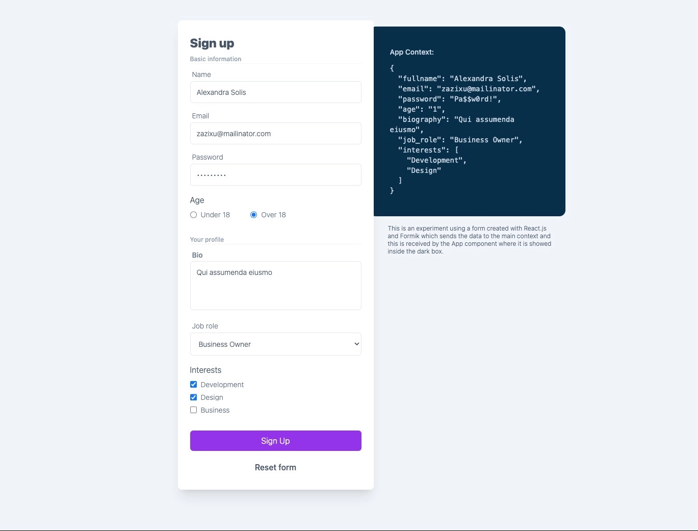

# Formik & form components

En este formulario, donde cada campo es un componente reutilizable, ha sido implementado con [Formik](https://formik.org/).

El objetivo es que el formulario envía la información al contexto principal de la aplicación y estos datos se muestran en pantalla.

Las funciones de validation, submit, reset y valores iniciales del formulario se encuentran modularizadas en helpers.

Es un simple ejercicio de componentes reutilizables de formulario y manejo del contexto de React.

